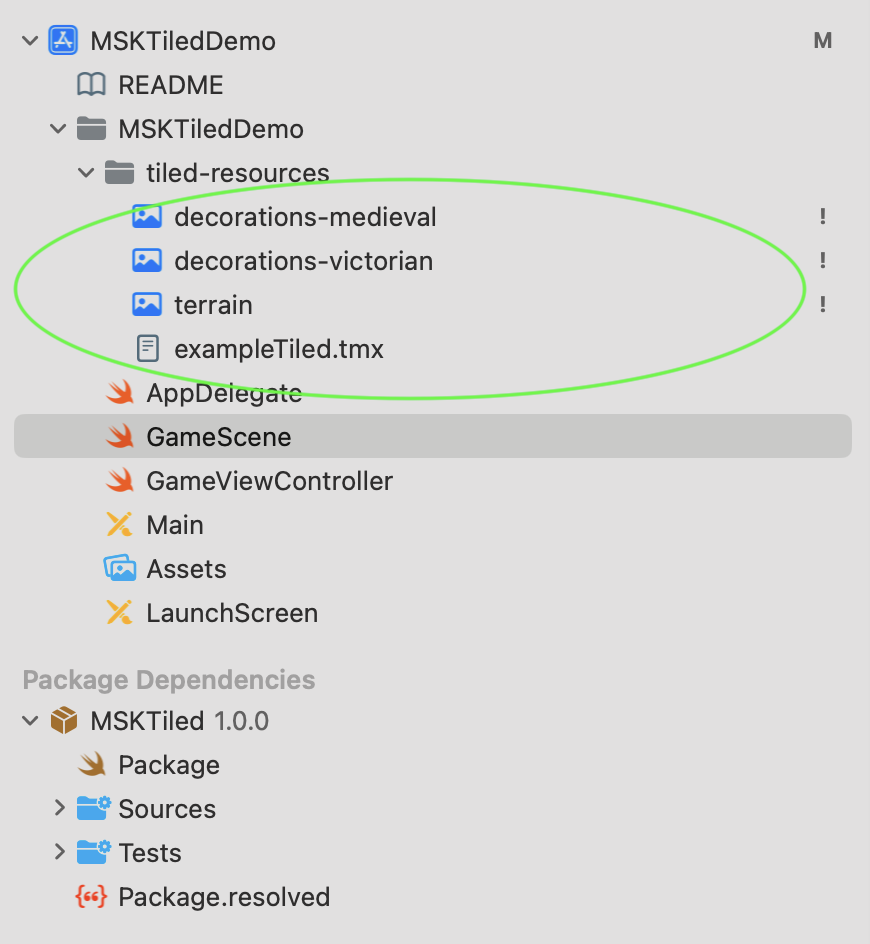

[](http://makeapullrequest.com)
[](https://img.shields.io/badge/Swift_Package_Manager-compatible-orange?style=flat-square)


# MSKTiled

This repository offers the capability to turn [Tiled](https://www.mapeditor.org) maps into [SKTileMapNode](https://developer.apple.com/documentation/spritekit/sktilemapnode) and related objects. It also offers additional functionality like pathfinding on the tilemap.

All sources are written in Swift.

## Example usage

For running examples using MSKTiled, please refer to the demo project [MSKTiledDemo](https://github.com/sanderfrenken/MSKTiledDemo)

## How to use MSKTiled

MSKTiled is a library to parse and render [Tiled](https://www.mapeditor.org) tilemaps. As such, you will need Tiled to create your tilemaps with.

It currently supports `Orthogonal` maps in `CSV` format.

There is no technical limitation on the tilemap size that can be rendered. Maps with for example 200x200 tiles render smoothly, and are condensed to single nodes by SKTileMapNode.

This means that instead of drawing 40.000 nodes, using `SKTileMapNode` you will see the amount of nodes that will be drawn is equal to the amount of layers in your tilemap.

As such `SKTileMapNode` is a very efficient mean to draw large tilemaps.

MSKTiled incorporates `SKCameraNode` and gesture recognizers. As such, you can pinch to zoom and swipe to move the camera. The camera is bound internally to the scene bounds.

MSKtiled offers tiled based pathfinding. However, regular A\* pathfinding that is used internally from `GKGridGraph` can become slow when searching for paths in large graphs. This will typically become noticable if you try to do pathfinding for many entities at the same time. 

In such cases, it might be more efficient to resort to `GKObstacleGraph` or `GKMeshGraph`. Pathfinding using these graphtypes does not come out of the box in this library, but it is easy to setup and explained subsequently.

### Initialisation

With MSKTiled we create `SKScene` instances programatically, and they need to inherit from `MSKTiledMapScene` (make sure to import MSKTiled):

```
class GameScene: MSKTiledMapScene {
    // stuff
}
```

We need to know the size of the scene we like to render, so from your `GameViewController` you can do something like this:

```
class GameViewController: UIViewController {

    override func viewDidLoad() {
        super.viewDidLoad()

        guard let skView = self.view as? SKView else {
            fatalError("SKView could not be referenced")
        }

        let scene: SKScene = GameScene(size: skView.bounds.size)
        scene.scaleMode = .resizeFill
        skView.presentScene(scene)
    }
}

```

This way, we have access to view's size, and are able to pass it along to our `MSKTiledMapScene` instances. 

This should be enough to start with the scene itself.

Once you have setup your tilemap in Tiled it should looklike this:


Pay attention to using `CSV` for encoding the map, and using `orthogonal` for orientation. Isometric is not supported so far.

For each layer present in the map, SKTiled will create a `SKTileMapNode`. We do need to instruct SKTiled what zPosition should be used per layer. This information can be provided using a dictionary:

```
let zPositionPerNamedLayer = [
    "base": 1,
    "obstacles": 2 // obstacles render above the base
]
```

Moreover, we need to inject the `minimumCameraScale`. This will instruct MSKTiled how far you enable the user to zoom in to the map. 

A lower value corresponds with a deeper zoom allowance.

The complete initialiser will now look like this:

```
super.init(size: size,
           tiledMapName: "exampleTiled",
           minimumCameraScale: 0.12,
           maximumCameraScale: nil,
           zPositionPerNamedLayer: zPositionPerNamedLayer)
```

Finally, we need to add our Tiled map to the app as well as the tilesheets we use. So drag and drop those in your project and that should be it:



Now hit run, and your map should appear.

### Pathfinding

TODO

## Installation

### Requirements

- iOS 10.3+
- Xcode 10.1+
- Swift 5+

### Swift Package Manager

The [Swift Package Manager](https://swift.org/package-manager/) is a tool for automating the distribution of Swift code and is integrated into the `swift` compiler.

Once you have your Swift package set up, adding MoreSpriteKit as a dependency is as easy as adding it to the `dependencies` value of your `Package.swift`.

```swift
dependencies: [
    .package(url: "https://github.com/sanderfrenken/MoreSpriteKit", .upToNextMajor(from: "1.0.0"))
]
```
### Manually

If you prefer not to use any of the aforementioned dependency managers, you can integrate the desired sources in your project manually, by adding the corresponding Swift files to your project.

### SwiftLint

We use Swiftlint from [Realm](https://realm.io/) to lint our code. SwiftLint has to be installed on your device.
More info can be found on [SwiftLint](https://github.com/realm/SwiftLint).
Details about the specific settings for this project can be found in the `.swiftlint.yml` file.

## Other information

- If you think that something is missing or would like to propose new feature, please create an issue.
- Please feel free to ⭐️ the project. This gives confidence that you like it which stimulates further development and support 🤩
- Looking for more SpriteKit extensions? Check out [MoreSpriteKit](https://github.com/sanderfrenken/MoreSpriteKit)

## Games using MSKTiled
The following games are using MSKTiled:

- [Battledom](https://sites.google.com/view/battledom/home)
- [Herodom](https://sites.google.com/view/herodom/home)

- Do you use MSKTiled in any of your applications? Please extend this list by making a PR!

## License

[MIT](https://opensource.org/licenses/MIT)
