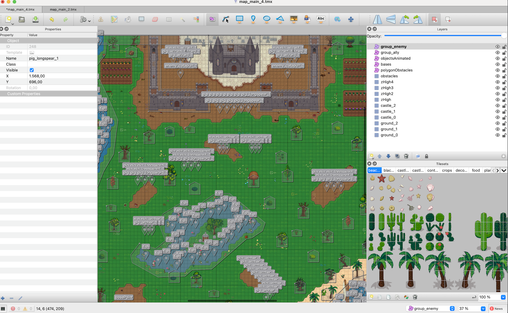
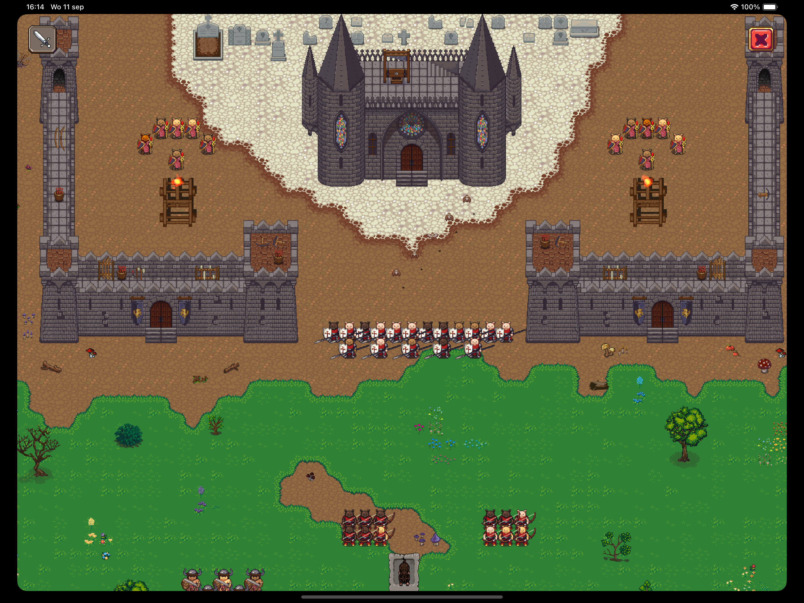

[](http://makeapullrequest.com)
[](https://img.shields.io/badge/Swift_Package_Manager-compatible-orange?style=flat-square)


# MSKTiled

This package offers the capability to turn [Tiled](https://www.mapeditor.org) maps into [SKTileMapNode](https://developer.apple.com/documentation/spritekit/sktilemapnode) and related objects. It also offers additional functionality like pathfinding on the tilemap.

All sources are written in Swift.

## Example usage

For running examples using `MSKTiled`, please refer to the demo project [MSKTiledDemo](https://github.com/sanderfrenken/MSKTiledDemo).

For illustrative purposes, this is an example map created in Tiled:



Using `MSKTiled`, this can be rendered in SpriteKit to this:




## How to use MSKTiled

*Note: For an easy overview, it is advised to checkout the demo project [MSKTiledDemo](https://github.com/sanderfrenken/MSKTiledDemo) as mentioned above.*

`MSKTiled` is a library to parse and render [Tiled](https://www.mapeditor.org) tilemaps. As such, you will need `Tiled` to create your tilemaps. `MSKTiled` currently supports `Orthogonal` maps in `CSV` format.

There is no technical limitation on the tilemap size that can be rendered. Maps with for example layers of 200x200 tiles render smoothly, and each layer is condensed to a single node by using `SKTileMapNode`. 

As a result, instead of drawing 40.000 individual nodes, by using `SKTileMapNode` you will see the amount of nodes that will be drawn is equal to the amount of layers in your tilemap. As such, `SKTileMapNode` is a very efficient mean to draw large tilemaps.

`MSKTiled` incorporates internally `SKCameraNode` and a pinch gesture recognizer. You can pinch to zoom and swipe to move the camera, and the camera is automatically bound to the scene bounds.

`MSKtiled` offers tiled based pathfinding. However, the regular A\* pathfinding that is used internally from `GKGridGraph` can become slow when searching for paths in large graphs. This will typically become noticable if you try to do pathfinding for many entities at the same time. 

In such cases, it might be more efficient to resort to `GKObstacleGraph` or `GKMeshGraph`. Pathfinding using these graphtypes does not come out of the box in this library, but it is easy to setup and explained subsequently.

### Initialisation

With MSKTiled we need to create an `SKScene` instance programatically that inherits from `MSKTiledMapScene` (make sure to import `MSKTiled`):

```
import MSKTiled

class GameScene: MSKTiledMapScene {
    // stuff
}
```

We need to know the size of the scene we like to render, so from your `GameViewController` you can do something like this:

```
class GameViewController: UIViewController {

    override func viewDidLoad() {
        super.viewDidLoad()

        guard let skView = self.view as? SKView else {
            fatalError("SKView could not be referenced")
        }

        let scene: SKScene = GameScene(size: skView.bounds.size)
        scene.scaleMode = .resizeFill
        skView.presentScene(scene)
    }
}

```

This way, we have access to view's size, and are able to pass it along to our `MSKTiledMapScene` instances. 

Once you have setup your tilemap in `Tiled` it should look like this:


Pay attention to using `CSV` for encoding the map, and using `orthogonal` for orientation. Other orientations are not supported so far.

For each layer present in the map, `MSKTiled` will create a `SKTileMapNode`. We need to instruct `MSKTiled` what `zPosition` should be used per layer. This information can be provided using a dictionary: 

```
let zPositionPerNamedLayer = [
    "base": 1,
    "obstacles": 2 // obstacles render above the base
]
```

The key responds to the name of the layer in `Tiled`, and the value to the `zPosition` the layer will be rendered at. If the layer is not found in the dictionary, the layer will be rendered on `zPosition` 0, which will most likely make it invisible.

Moreover, we need to inject the `minimumCameraScale`. This will instruct `MSKTiled` how far you enable the user to zoom in to the map, a lower value corresponds with an increase in zoom allowance.

The complete initialiser will now look like this:

```
super.init(size: size,
           tiledMapName: "exampleTiled",
           minimumCameraScale: 0.12,
           maximumCameraScale: nil,
           zPositionPerNamedLayer: zPositionPerNamedLayer)
```

The `maximumCameraScale` can be used to instruct how far a user is allowed to zoom out from the map. The larger the value, the smaller the map will become. It is not allowed to inject the `maximumCameraScale` being larger than possible (which would mean the map would be rendered smaller than the scene's size). In this case, the initializer throws a `fatalError`.

Finally, we need to add our tilemap (`.tmx`) to the app as well as the tilesheets (`.png`) we use:


Now hit run, and your map should appear.

### Layers

For each layer as defined in `Tiled` `MSKTiled` creates an [SKTileMapNode](https://developer.apple.com/documentation/spritekit/sktilemapnode). These layers can be accessed directly by using:

```
if let layer = getLayer(name: "obstacles") {
    // layer is a regular SKTileMapNode which you can manipulate as desired
}
```

### Custom properties

Inside `Tiled` you can set custom properties. `MSKTiled` support custom properties on tiles, objects and object layers.

#### Layers and objects
To get the custom properties set on an object layer or its contained objects for example, one can use:

```
tiledObjectGroups?.forEach({ group in // tiledObjectGroups represent the object layers defined in Tiled as `[MSKTiledObjectGroup]`
    group.properties // get the layer's custom properties
    group.objects?.forEach({ object in // each object inside an object layer in Tiled is stored to the `MSKTiledObjectGroup` as an `[MSKTiledObject]`
        object.properties // get the object's custom properties
    })
})
```

#### Tiles

To get the custom properties set for a specific tile contained in a layer, you can use:

```
if let obstacleLayer = getLayer(name: "obstacles") {
    let tileDefinition = obstacleLayer.tileDefinition(atColumn: 0, row: 0) // get the SKTileDefinition
    tileDefinition?.userData? // properties from Tiled are stored in the tileDefinition's userData
}
```

### Pathfinding

You can use pathfinding built-in to `MSKTiled`. In order to do this, you need to define a path graph.
For example, your `Tiled` map can have a layer which holds all the obstacle tiles. 

By updating the pathgraph using the specified layer, `MSKTiled` will inspect that layer and add an obstacle for each tile that is present in the layer:

```
if let obstacleLayer = getLayer(name: "obstacles") {
    updatePathGraphUsing(layer: obstacleLayer, diagonalsAllowed: true)
}
```

Now, if you aim to find a path between a `startTile` and an `endTile`, you can do as follows:

```
// convert scene coordinates to valid tiles
guard let startTile = getTileFromPositionInScene(position: startTilePosition), 
      let endTile = getTileFromPositionInScene(position: endTilePosition) else {
    return
}

// assert the tiles are valid
// this built-in method checks that the tile is inside the scene bounds and is not an obstacle
if !isValidPathTile(tile: startTile) || !isValidPathTile(tile: endTile) {
    return
}

if let path = getPath(fromTile: firstTile, toTile: tile) {
    // your path in MSKTiledTile objects is available
}

```

### Caching

Parsing tilemaps the first time is expensive as `MKSTiled` will need to create the individual tiles from the tilesheets referenced in the map by using [SKTexture(rectIn:)](https://developer.apple.com/documentation/spritekit/sktexture/1520425-init). These individual tiles (which are just images) will be by default written inside the app container for future usage. This behavior can be disabled though by injecting `allowTileImagesCache` set to `false`:

```
super.init(size: size,
            tiledMapName: "exampleTiled",
            minimumCameraScale: 0.12,
            maximumCameraScale: nil,
            zPositionPerNamedLayer: zPositionPerNamedLayer,
            allowTileImagesCache: false)
```

## Installation

### Requirements

- iOS 10.3+
- Xcode 10.1+
- Swift 5+

### Swift Package Manager

The [Swift Package Manager](https://swift.org/package-manager/) is a tool for automating the distribution of Swift code and is integrated into the `swift` compiler.

Once you have your Swift package set up, adding MoreSpriteKit as a dependency is as easy as adding it to the `dependencies` value of your `Package.swift`.

```swift
dependencies: [
    .package(url: "https://github.com/sanderfrenken/MoreSpriteKit", .upToNextMajor(from: "1.0.0"))
]
```
### Manually

If you prefer not to use any of the aforementioned dependency managers, you can integrate the desired sources in your project manually, by adding the corresponding Swift files to your project.

### SwiftLint

We use Swiftlint from [Realm](https://realm.io/) to lint our code.
More info can be found on [SwiftLint](https://github.com/realm/SwiftLint).
Details about the specific settings for this project can be found in the `.swiftlint.yml` file.

## Other information

- If you think that something is missing or would like to propose new feature, please create an issue.
- Please feel free to ⭐️ the project. This gives confidence that you like it which stimulates further development and support 🤩
- Looking for more SpriteKit extensions? Check out [MoreSpriteKit](https://github.com/sanderfrenken/MoreSpriteKit)

## Games using MSKTiled
The following games are using MSKTiled:

- [Battledom](https://sites.google.com/view/battledom/home)
- [Herodom](https://sites.google.com/view/herodom/home)

- Do you use `MSKTiled` in any of your applications? Please extend this list by making a PR!

## License

[MIT](https://opensource.org/licenses/MIT)
